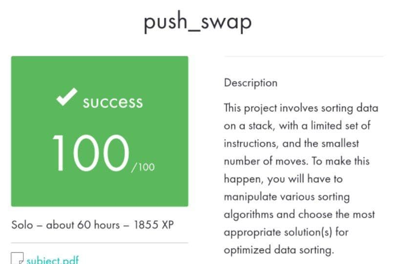

# push_swap

В файле en.subject.pdf - задание.

P.S. Это учебные работы, они были ограниченны определенными условиями и правилами написания кода. Поэтому не удивляйтесь, что все выводится через write или везде используется цикл while и пр. =)

